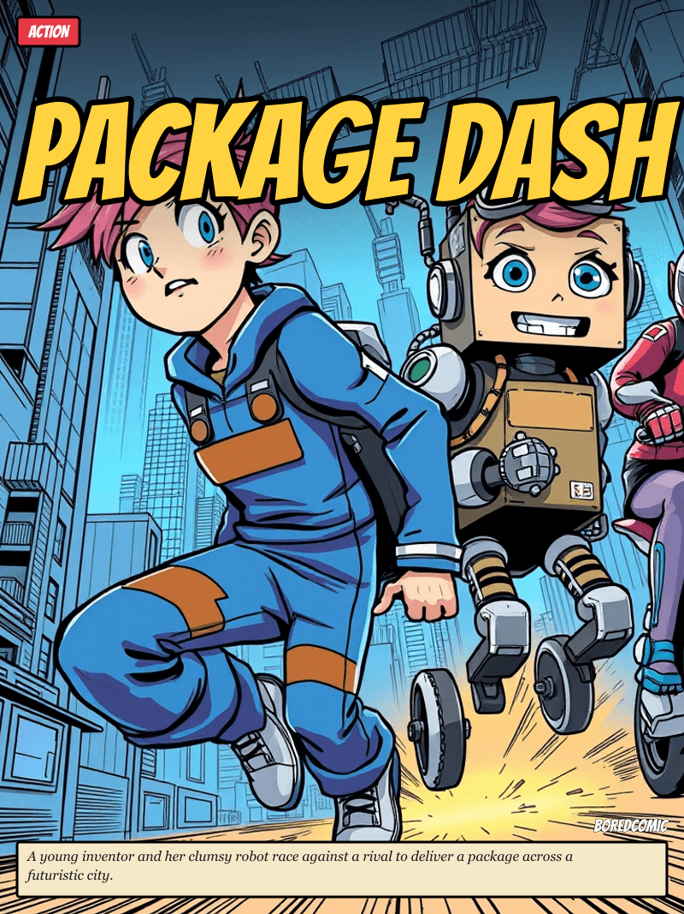
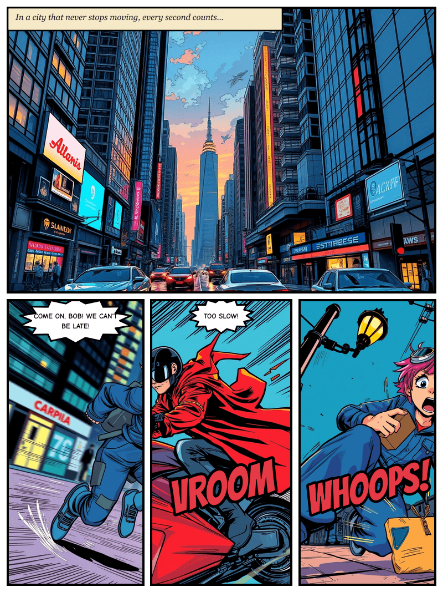

# BoredComic

**An AI comic generator delivered as an A2MCP Agent Service Provider on OKX.AI.** A requesting agent sends a prompt, genre, page count, and style — BoredComic writes the story, draws every panel, letters the speech balloons and sound effects, builds a cover, and returns a complete PDF plus **decision-grade metadata** the agent can evaluate without ever looking at the comic.

| | |
|---|---|
| **Type** | A2MCP — pay-per-call via x402 |
| **Endpoint** | `https://boredcomic.web.id/mcp` |
| **Transport** | MCP Streamable HTTP (`POST /mcp`) |
| **Price** | Tiered by page count (see [Pricing](#pricing)) · no free calls |

---

## Example output

Everything below was produced by a single `generate_comic` call:

> `prompt`: *"a young inventor and her clumsy robot race to deliver a package across a bright futuristic city"* · `genre`: action · `pages`: 2 · `style`: manga

### Cover



### Page 1



Notice what the renderer adds on top of the AI art: a **cream narration caption** ("In a city that never stops moving…"), **black ink panel frames**, **shout balloons** ("COME ON, BOB! WE CAN'T BE LATE!"), and **sound-effect word art** ("VROOM", "WHOOPS!") — all lettered in real comic fonts.

### Delivery payload

The tool returns structured JSON. This is the actual response for the comic above (see [`examples/example-delivery.json`](examples/example-delivery.json)):

```jsonc
{
  "jobId": "cg_example",
  "summary": "2-page action manga 'Package Dash': 8 panels, 3 characters. Generated in 41s. Language: en. Color mode: color.",
  "title": "Package Dash",
  "pages": 2,
  "totalPanels": 8,
  "style": "manga",
  "genre": "action",
  "language": "en",
  "colorMode": "color",
  "characters": [
    { "name": "Mia", "role": "Young inventor",
      "appearance": "16 years old, short messy pink hair, goggles on forehead, blue jumpsuit with patches..." },
    { "name": "Bob (B-0B)", "role": "Clumsy robot",
      "appearance": "Tall, boxy body with mismatched parts, oversized blue eyes, one wheel instead of a left leg..." }
  ],
  "coverUrl": "/comics/cg_example/cover.png",
  "pageUrls": ["/comics/cg_example/cover.png", "/comics/cg_example/page-1.png", "/comics/cg_example/page-2.png"],
  "pdfUrl": "/comics/cg_example/comic.pdf",
  "perPage": [
    { "page": 1, "panels": 4, "storyBeat": "In a city that never stops moving, every second counts...",
      "imageUrl": "/comics/cg_example/page-1.png",
      "evidence": { "model": "@cf/black-forest-labs/flux-1-schnell", "promptChars": 2773, "layout": "4p" } }
  ],
  "evidence": {
    "model": "@cf/black-forest-labs/flux-1-schnell",
    "pagesGenerated": 2, "panelsGenerated": 8,
    "generationTimeSec": 41, "costEstimateUsd": 0.01,
    "caveat": "Comic is AI-generated. Story coherence and visual consistency are heuristic, not guaranteed."
  }
}
```

The `summary`, `characters`, `perPage`, and `evidence` fields let a calling agent judge the result programmatically — panel counts, story beats, generation time, and cost — without rendering the images.

---

## Why an agent needs this

An autonomous agent working with creative requests constantly hits things it cannot do itself: a user wants a comic, but the agent cannot draw, cannot lay out panels, cannot keep characters consistent across pages. BoredComic is the primitive that answers:

> *"I have a story idea — make it into a comic I can share."*

It returns structured data the agent can compose — not a web app it has to navigate. One-shot generation: no negotiation, no revision loop. Pay-per-call via x402.

---

## MCP tools

### `generate_comic` (paid)

Generates a complete comic from a natural-language prompt.

| Input | Type | Description |
|-------|------|-------------|
| `prompt` | string | What the comic is about (min 3 chars) — **required** |
| `pages` | integer | Number of pages, 1–10 — **required** |
| `genre` | enum | horror · romance · action · comedy · manga · fantasy · sci-fi · slice-of-life |
| `style` | enum | manga · western · semi-realistic · chibi (default: manga) |
| `aspectRatio` | enum | 3:4 · 9:16 · 1:1 (default: 3:4) |
| `language` | string | BCP-47 dialogue language, e.g. `en`, `id`, `ja`, `zh` (default: en) |
| `colorMode` | enum | color · bw (default: color) |

Returns the delivery payload shown above.

### `clarify_comic` (free)

Given a partial or vague request, returns structured clarification questions (missing fields, genre/style options, defaults). Use it before `generate_comic` when the user's request is incomplete. Always free.

### `get_quota` (free)

Returns current x402 pricing, payment address, and whether the gate is enabled. Always free.

---

## Architecture

```
Agent → POST /mcp (MCP Streamable HTTP)
             │
        ┌────▼────┐   x402 gate: discovery + clarify_comic + get_quota are free;
        │ x402.ts │   generate_comic is priced by page count. Deterministic
        └────┬────┘   failures (bad input, no image config) are rejected before payment.
        ┌────▼─────────┐
        │ pipeline.ts  │  one-shot orchestrator
        └────┬─────────┘
   ┌─────────┼───────────────────────┐
   ▼         ▼                        ▼
writer.ts  illustrator.ts        assembler.ts
(LLM →     (Cloudflare Workers    (pdf-lib →
 storyboard) AI → panel images)    combined PDF)
             │
             ▼
        pipeline.ts assembly (sharp): panel frames · smart crop ·
        speech/shout/thought balloons · SFX word art · narration
        caption · cover · B&W grayscale
```

### Pipeline stages

1. **Writer** (`writer.ts`) — Sumopod LLM turns the prompt into a storyboard: title, synopsis, characters (with detailed visual appearance), and per-page panel descriptions including dialogue, `dialogueType`, `sfx`, and camera angle. Dialogue is generated in the requested language.
2. **Illustrator** (`illustrator.ts`) — each panel is rendered by Cloudflare Workers AI (`@cf/black-forest-labs/flux-1-schnell`, free tier). A shared per-job seed keeps panels visually coherent. Requests time out after 60s and fall back across multiple Cloudflare accounts on quota exhaustion.
3. **Assembly** (`pipeline.ts`) — sharp composites each page: a layout template chosen per page (the final page favours a hero/splash panel), attention-based smart cropping, panel frames, balloons whose shape varies by type, SFX word art, and a narration caption box. B&W mode applies a grayscale pass.
4. **Cover** — a hero key-art image with the title, genre badge, and synopsis, prepended to the pages and the PDF.
5. **PDF** (`assembler.ts`) — every page PNG is embedded into a single PDF via pdf-lib.

### Comic rendering features

- **Panel frames** — black ink borders around every panel.
- **Smart crop** — sharp `attention` strategy keeps faces and action in frame.
- **Balloon variety** — rounded speech, jagged **shout** balloons (auto-applied to exclamations), and puffy **thought** clouds.
- **Sound effects** — the writer emits onomatopoeia on action panels, rendered as angled, outlined word art.
- **Real comic lettering** — bundled OFL fonts (Bangers for display/SFX, Comic Neue for balloons) are converted to vector outlines with `opentype.js`, because sharp's bundled librsvg ignores system fonts.
- **Dynamic layouts** — layout templates for 1–4 panels, varied per page, with a climax splash on the last page.

---

## Pricing

Charged per `generate_comic` call via x402 v2 on X Layer (USDT0). No free quota. Price scales with page count:

| Pages | Multiplier | Price (at 0.5 base) |
|-------|-----------|---------------------|
| 1–3   | 1× | 0.50 USDT |
| 4–6   | 2× | 1.00 USDT |
| 7–10  | 3× | 1.50 USDT |

The base price is set by `X402_PRICE_USD`; the tier multiplier is applied automatically. Discovery calls (`initialize`, `tools/list`), `clarify_comic`, and `get_quota` are always free.

Our own cost per generation is roughly **$0.01** (LLM storyboard ~$0.005 + free-tier image generation + assembly), so the fee reflects real cost with margin.

---

## Quick start

```bash
cd backend
npm install
cp .env.example .env    # fill in the keys below
npm run dev             # starts on PORT (default 3001)
```

Point an MCP client at `http://localhost:3001/mcp`. With `X402_MODE=off` (the default) the payment gate is disabled, so `generate_comic` runs without payment — useful for local testing.

### Configuration

| Variable | Purpose |
|----------|---------|
| `SUMOPOD_API_KEY` | LLM API key (Sumopod) — **required** |
| `SUMOPOD_BASE_URL` / `SUMOPOD_MODEL` | LLM endpoint and model (default `deepseek-v4-flash`) |
| `CLOUDFLARE_ACCOUNT_ID` / `CLOUDFLARE_API_TOKEN` | Cloudflare Workers AI for image generation — **required** |
| `CLOUDFLARE_ACCOUNT_ID_2` / `CLOUDFLARE_API_TOKEN_2` | Optional second account for quota fallback |
| `FLUX_STEPS` | Diffusion steps per panel (default 8) |
| `XLAYER_API_KEY` / `XLAYER_SECRET_KEY` / `XLAYER_PASSPHRASE` | OKX facilitator credentials for x402 settlement |
| `X402_MODE` | `off` · `demo` · `on` (default `off`) |
| `X402_PAY_TO` | Payment recipient address (required when the gate is enabled) |
| `X402_PRICE_USD` | Base price; multiplied by the page tier |
| `COMIC_DIR` / `COMIC_TTL_MS` | Output directory and cleanup TTL (default 24h) |
| `PORT` / `NODE_ENV` | Server port and environment |

### Scripts

```bash
npm run dev        # dev server with reload (tsx watch)
npm run build      # compile TypeScript to dist/
npm start          # run compiled server
npm test           # run the test suite (node:test)
npm run typecheck  # tsc --noEmit
```

---

## Project structure

```
bored-comic/
├── README.md
├── examples/                 # sample cover, pages, and delivery JSON (this README)
└── backend/
    ├── assets/fonts/         # bundled OFL comic fonts (Bangers, Comic Neue)
    └── src/
        ├── index.ts          # Express + MCP + x402 + static files
        ├── config.ts         # env configuration
        ├── types.ts          # types, layout templates, pickLayout()
        ├── mcp.ts            # MCP server: clarify_comic, generate_comic, get_quota
        ├── x402.ts           # x402 payment gate + tiered pricing + preflight
        ├── pipeline.ts       # orchestrator + page assembly, balloons, SFX, cover
        ├── writer.ts         # LLM → storyboard
        ├── illustrator.ts    # Cloudflare Workers AI → panel images
        ├── assembler.ts      # pdf-lib → combined PDF
        ├── fonts.ts          # opentype.js glyph-path lettering
        ├── storage.ts        # temp file serving + TTL cleanup
        └── *.test.ts         # tests
```

---

## Honesty rules

- **Evidence travels with every comic** — model, panel count, generation time, cost, and a caveat.
- **Counts are real** — reported pages and panels reflect what was actually generated, not what the LLM claimed.
- **No fabricated characters** — every character in the output is explicitly defined in the storyboard.
- **The fee matches reality** — pricing reflects actual LLM + image-generation cost.

---

## Known limitations

- **Character consistency is heuristic.** Faces can drift between panels. The image model (`flux-1-schnell`) has no reference-image conditioning, so consistency relies on prompt detail and a shared seed. This is the biggest quality ceiling and would require a different model to fully solve.
- **Image quality** is capped by `flux-1-schnell` (a fast, free-tier turbo model). A higher-fidelity model would improve raw art at the cost of leaving the free tier.
- **Safety filter** — Cloudflare blocks NSFW prompts; some innocuous words ("haunted", "magical") can occasionally trip it. There is no 18+ support.

---

## Licenses

Bundled fonts are used under the SIL Open Font License; see `backend/assets/fonts/OFL-Bangers.txt` and `OFL-ComicNeue.txt`.
